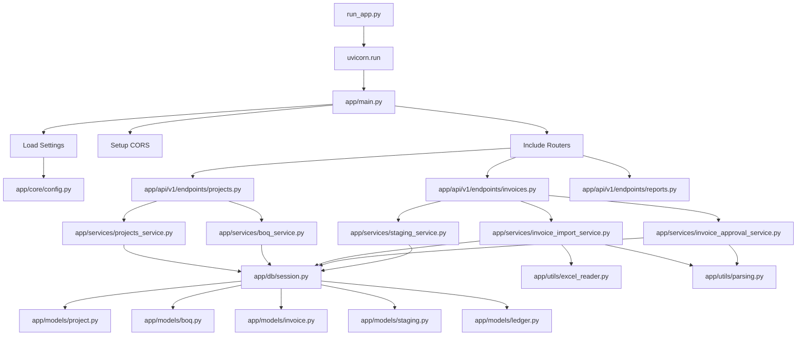
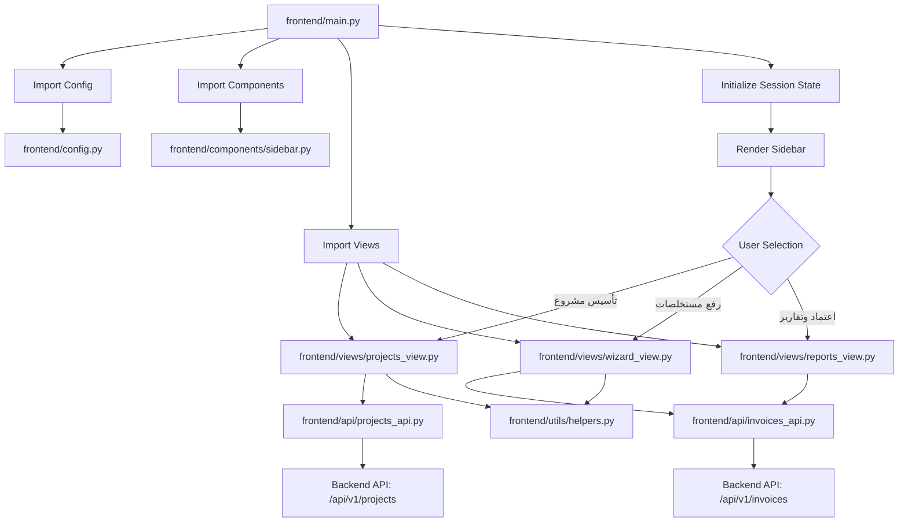
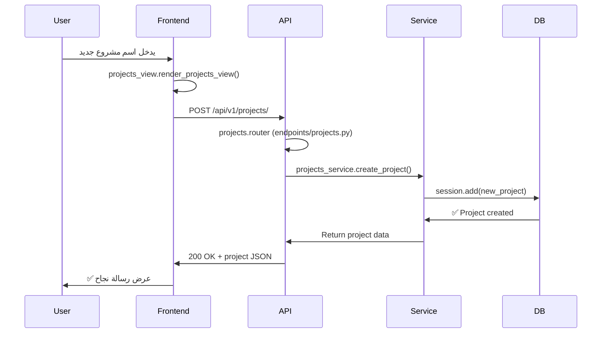

# 🚀 خريطة تشغيل وتنفيذ البرنامج

## 📍 نقاط البداية (Entry Points)

### 1️⃣ **Backend (API Server)**
**الأمر:**
```bash
py run_app.py
```

**نقطة البداية:** [`run_app.py`](file:///f:/EPR%20Invoice/construction_backend/run_app.py)

---

### 2️⃣ **Frontend (Streamlit UI)**
**الأمر:**
```bash
streamlit run frontend/main.py
```

**نقطة البداية:** [`frontend/main.py`](file:///f:/EPR%20Invoice/construction_backend/frontend/main.py)

---

## 🔄 مسار تنفيذ الـ Backend

### التسلسل التفصيلي:

```
1. run_app.py
   ↓
2. uvicorn.run("app.main:app")
   ↓
3. app/main.py
   ├─→ 4. app/core/config.py (تحميل الإعدادات)
   ├─→ 5. Setup CORS Middleware
   └─→ 6. تضمين الـ Routers:
       ├─→ app/api/v1/endpoints/projects.py
       │   ├─→ app/services/projects_service.py
       │   │   └─→ app/db/session.py → app/models/project.py
       │   └─→ app/services/boq_service.py
       │       └─→ app/db/session.py → app/models/boq.py
       │
       ├─→ app/api/v1/endpoints/invoices.py
       │   ├─→ app/services/invoice_import_service.py
       │   │   ├─→ app/utils/excel_reader.py
       │   │   ├─→ app/utils/parsing.py
       │   │   └─→ app/db/session.py → app/models/invoice.py, staging.py
       │   ├─→ app/services/invoice_approval_service.py
       │   │   ├─→ app/utils/parsing.py
       │   │   └─→ app/db/session.py → app/models/invoice.py, ledger.py
       │   └─→ app/services/staging_service.py
       │       └─→ app/db/session.py → app/models/staging.py
       │
       └─→ app/api/v1/endpoints/reports.py
           └─→ app/db/session.py → app/models/ledger.py
```

### Mermaid Diagram (للعرض في VS Code Preview):



### شرح المسار:

1. **البداية:** `run_app.py` ← يشغل Uvicorn server
2. **التهيئة:** `app/main.py` ← ينشئ FastAPI app
3. **الإعدادات:** `app/core/config.py` ← يقرأ الـ settings
4. **Routers:** يضيف 3 routers (projects, invoices, reports)
5. **عند استقبال Request:**
   - يروح للـ Router المناسب في `app/api/v1/endpoints/`
   - الـ Router ينادي على الـ Service المناسب
   - الـ Service يتعامل مع الـ Database عبر `get_db()`
   - يستخدم الـ Models للقراءة/الكتابة
   - يرجع النتيجة للـ Router ← للـ User

---

## 🎨 مسار تنفيذ الـ Frontend

### التسلسل التفصيلي:

```
1. frontend/main.py
   ├─→ 2. Import frontend/config.py (API_BASE_URL, PAGE_TITLE)
   ├─→ 3. Import frontend/components/sidebar.py
   ├─→ 4. Import frontend/views/ (projects_view, wizard_view, reports_view)
   ├─→ 5. Initialize Session State (step, mappings, etc.)
   └─→ 6. Render Sidebar
       └─→ 7. User Selection:
           ├─→ "تأسيس مشروع"
           │   └─→ frontend/views/projects_view.py
           │       ├─→ frontend/api/projects_api.py
           │       │   └─→ HTTP → Backend: /api/v1/projects/
           │       └─→ frontend/utils/helpers.py
           │
           ├─→ "رفع مستخلصات"
           │   └─→ frontend/views/wizard_view.py
           │       ├─→ frontend/api/invoices_api.py
           │       │   └─→ HTTP → Backend: /api/v1/invoices/upload
           │       └─→ frontend/utils/helpers.py (get_col_letter)
           │
           └─→ "اعتماد وتقارير"
               └─→ frontend/views/reports_view.py
                   └─→ frontend/api/invoices_api.py
                       ├─→ HTTP → Backend: /api/v1/invoices/{id}/staging
                       ├─→ HTTP → Backend: /api/v1/invoices/{id}/approve
                       └─→ HTTP → Backend: /api/v1/reports/schedule/{id}
```

### Mermaid Diagram (للعرض في VS Code Preview):



### شرح المسار:

1. **البداية:** `frontend/main.py` ← Streamlit app entry point
2. **التهيئة:**
   - يقرأ Config من `frontend/config.py`
   - يجهز Session State
3. **عرض الواجهة:**
   - يعرض Sidebar من `frontend/components/sidebar.py`
   - المستخدم يختار صفحة
4. **عند اختيار صفحة:**
   - ينادي على الـ View المناسب
   - الـ View يستخدم API clients للتواصل مع Backend
   - يعرض النتائج للمستخدم

---

## 🔗 مثال: مسار Request كامل (Create Project)

### الخطوات بالترتيب:

```
1. User (المستخدم)
   → يدخل اسم مشروع جديد في الواجهة
   
2. Frontend (frontend/views/projects_view.py)
   → يستدعي projects_view.render_projects_view()
   → يرسل: POST /api/v1/projects/
   → Body: {"name": "اسم المشروع", "location": "الموقع"}
   
3. Backend API (app/api/v1/endpoints/projects.py)
   → يستقبل الـ Request
   → Router: projects.router
   → ينادي: projects_service.create_project(db, data)
   
4. Service Layer (app/services/projects_service.py)
   → ينشئ كائن Project جديد
   → يضيفه للـ session: db.add(new_project)
   → يحفظ: db.commit()
   → يرجع: البيانات المحفوظة
   
5. Database (app/db/session.py → app/models/project.py)
   → ينفذ INSERT INTO projects
   → يرجع: ✅ Project created with ID
   
6. Response يرجع عكس المسار:
   Service → API → Frontend
   → Status: 200 OK
   → Body: {"id": 1, "name": "...", "location": "..."}
   
7. Frontend
   → يعرض: ✅ "تم الحفظ!"
   → يحدث قائمة المشاريع (cache clear)
```

### Sequence Diagram (للعرض في VS Code Preview):



---

## 📋 ملخص نقاط البداية

| Component | Entry Point | Command |
|-----------|-------------|---------|
| **Backend API** | `run_app.py` | `py run_app.py` |
| **Frontend UI** | `frontend/main.py` | `streamlit run frontend/main.py` |

---

## 🎯 كيفية التشغيل الكامل

### Terminal 1 (Backend):
```bash
cd "f:\EPR Invoice\construction_backend"
py run_app.py
```
**النتيجة:** Backend running on http://localhost:8000

### Terminal 2 (Frontend):
```bash
cd "f:\EPR Invoice\construction_backend"
streamlit run frontend/main.py
```
**النتيجة:** Frontend running on http://localhost:8501

---

## 🧭 الخلاصة

1. **Backend** يبدأ من `run_app.py` → `app/main.py` → Routers → Services → Database
2. **Frontend** يبدأ من `frontend/main.py` → Views → API Clients → Backend API
3. الاثنين مستقلين، Frontend يكلم Backend عبر HTTP requests
